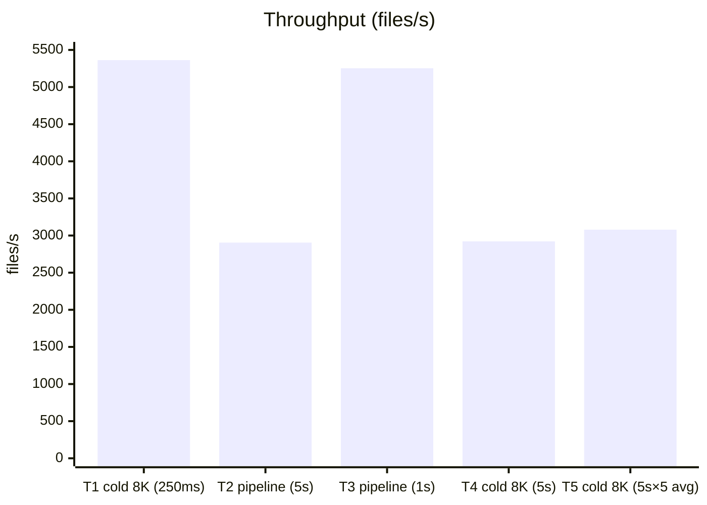

# RIDE (Real-time Intrusion Detection Events)

An eBPF-based modern approach to File Integrity Monitoring (FIM):

- This project aims to implement next-generation, AIDE-style intrusion
  detection.
- Uses the latest algorithms for efficient, high-speed hashing (BLAKE3).
- eBPF in-kernel program communicates with userspace via a shared ring 
  buffer (mmap'd), effectively achieving zero-copy and no syscalls per event
- On a ThinkPad E40 with an SSD on btrfs, it currently measures about
  3,000 files/sec (5-run average) when reading 25,000 non-cached 8KB
  files over a 5-second window.
- Plans to support various "stores" for the verification database,
  including:
  - File-based (similar to AIDE)
  - Remote over UDP or other transports
  - Hardware-based attestation

Note that RIDE is not an enterprise-style EDR: its simpler, UNIX-like,
single-purpose architecture makes it more accessible and embeddable (e.g., in
containers).

## Contents

- [Modern, eBPF-based, high-throughput monitoring](#modern-ebpf-based-high-throughput-monitoring)
- [Implementation](#implementation)
- [Benchmarks](#benchmarks)
- [Examples of attacks that could be detected](#examples-of-attacks-that-could-be-detected)
- [Other tools](#other-tools)
- [AI Policy](#ai-policy)

## Modern, eBPF-based, high-throughput monitoring

Classic FIM tools scan periodically: the larger the set of watched
files, the longer the scanning takes. Instead, RIDE verifies
file events as they happen; and its high-throughput implementation makes
it practical to watch basically all file events continuously:

- Coverage is no longer limited to a small set of files: binaries,
  configuration files, and data files can all be watched continuously.
- Tampering is detected at the moment of use, when a file is opened,
  executed, or otherwise accessed, as opposed to the next scheduled scan.
- Events are delivered through kernel hooks instead of periodic
  full-filesystem sweeps, so the steady-state cost stays low even with
  a large watch set.

## Implementation

- Real-time events triggered by an eBPF LSM kernel program, paired with
  an efficient, high-throughput userspace component to process the
  events:
  - eBPF communicates with userspace via a shared ring buffer (mmap'd) =
    zero-copy and no per-event syscalls!
  - eBPF hooks trigger in the kernel = more reliable and faster than
    inotify.
  - One can theoretically attach eBPF programs to additional hooks to
    verify file integrity at different points, such as on open, delete,
    or link.
- Multi-threaded, async-IO-capable userspace to process events for
  higher throughput:
  - Each instance is capable of up to 32 concurrent IO reads.
  - Multiplied by the number of threads.
- Written in C for a lightweight, efficient binary; remote stores may be
  implemented in Rust to support a richer set of features on the
  verifier side.

## Benchmarks

**Headline: ~3,000 files/s sustained end-to-end** — hashing 25,000
non-cached 8 KB files over a 5-second window, averaged over 5 runs
(3,079 files/s, range 2,805–3,311). See test 5 below.

Single run per test case (except #5: 5 runs). Hardware: ThinkPad E40, SSD, btrfs.

| # | Test case | Window | Distinct files | Payload | Cache state | Correctness | Processed | Throughput |
|---|-----------|--------|----------------|---------|-------------|-------------|-----------|------------|
| 1 | End-to-end, cold cache (short) | 250 ms | 4,000 | 8 KB random | Cold (dropped) | Verified vs `b3sum` | 1,362 | **5,362 files/s** |
| 2 | Worker pipeline, long run | 5 s | 20,000 | Empty | n/a | Skipped | 14,532 | **2,905 files/s** |
| 3 | Worker pipeline, dev iteration | 1 s | 10,000 | Empty | n/a | Skipped | 5,264 | **5,253 files/s** |
| 4 | End-to-end, cold cache (long) | 5 s | 15,000 | 8 KB random | Cold (dropped) | Verified vs `b3sum` | 14,616 | **2,921 files/s** |
| **5** | **End-to-end, cold cache (long, multi-run)** | **5 s × 5 runs** | **25,000** | **8 KB random** | **Cold (dropped)** | **Skipped (est. by #4)** | **14,037–16,566** | **3,079 files/s avg (2,805–3,311)** |

Methodology &amp; notes

RIDE's throughput is measured with an **open-loop load test**
(`tests/0_worker_throughput.sh`): a background workload generator issues
file-open events against the watched directory as fast as possible for a
fixed measurement window, without waiting for RIDE to finish processing
previous events. This drives RIDE toward saturation; throughput is then
`completed hashes ÷ window length`.

- RIDE runs with 4 worker threads × 16 concurrent I/O reads per thread
  (`-t 4 -c 16`, i.e. up to 64 in-flight reads), with a short warm-up
  so the eBPF program is attached before the measurement window opens.
- Two workload modes:
  - **Cold-cache, 8 KB random payloads**: files are synced and the page
    cache is dropped before the run, so every read hits disk; measures
    the full end-to-end cost of disk I/O + BLAKE3 hashing.
  - **Empty files**: reduces hashing cost to the bare minimum, isolating
    worker-pipeline (event-drain) throughput.
- Correctness: every emitted hash is verified against `b3sum` (skipped
  in the pipeline-throughput variants, where functional correctness is
  already established by the verified runs).
- Validity guards: the generator makes three passes over the file set,
  so repeat opens of real payloads may be served from the page cache
  once the first pass completes; a run therefore fails if completed
  reads reach the number of distinct files.

Notes:

- Test 5 is the headline end-to-end number: five runs of the cold-cache
  workload averaged 3,079 files/s (range 2,805–3,311), consistent with
  test 4's single-run 2,921 files/s on the same workload. Every run
  completed fewer reads than the 25,000 distinct files, so the first
  pass never finished and every completed read was genuinely cold.
- Test 4 establishes the same workload's correctness: 14,616 completed
  reads < 15,000 distinct files, so the first pass never finished and
  every completed read was genuinely cold.
- Tests 1 and 4 verify every emitted hash against `b3sum`: 0 mismatches
  across 15,978 verified hashes — throughput and correctness measured
  together.
- Short windows read high: test 1 (250 ms) shows ~1.8× the sustained
  5 s figure for the same cold-cache workload and configuration
  (test 4), because the pipeline starts empty and all I/O slots are
  free at window open. Treat sub-second figures as burst throughput;
  the 5 s rows are the representative sustained numbers.
- Tests 2, 3, and 5 skip verification to isolate throughput, relying on
  the verified runs for correctness. Tests 2 and 3 are single runs, so
  those numbers are indicative rather than statistically rigorous;
  test 5 repeats the cold-cache workload 5 times (10 s cool-down
  between runs) for better statistical confidence.

## Examples of attacks that could be detected

- Page-cache tampering of the DirtyFrag / DirtyPipe / Dirty COW class
  (CVE-2022-0847, CVE-2016-5195): polluted page-cache content detected
  against the baseline checksum.
- Supply-chain incidents, which are often silent and undetected until
  too late: the XZ Utils backdoor (CVE-2024-3094), SolarWinds Orion
  (SUNBURST), npm event-stream.
- Configuration-file tampering: appended keys in
  `~/.ssh/authorized_keys`, direct edits to `/etc/passwd` or
  `/etc/shadow`, persistence via new or modified systemd units or cron
  entries.
- Data-file tampering, impractical to watch with periodic scanning:
  web shells dropped into webroots, or unexpected modification of
  rotated log files to erase evidence of earlier activity.

## Other tools

- pagecache-guard: monitors a specific class of files (SUID/SGID) via
  fanotify; aims to detect and protect against binary tampering.
- Linux IMA/EVM: powerful in-kernel file measurement and appraisal,
  but host-based, with a very complex setup and a steep learning curve.
- Samhain / Tripwire / AIDE: classic host-based FIM with periodic
  scanning — no real-time detection.
- Falco / Tracee / Tetragon: eBPF-based runtime security platforms;
  general-purpose rule engines, far heavier to deploy and operate.
- Wazuh / OSSEC: full HIDS suites with an FIM module; agent-manager
  architecture aimed at fleets.

## AI Policy

Given the sensitive nature of this security tool, contributors must fully
understand every line they submit. This project therefore does not accept
AI-assisted **code** contributions. However, AI tools may be used for
supporting tasks such as code review, research, and documentation.

---

**License:** Apache 2.0

